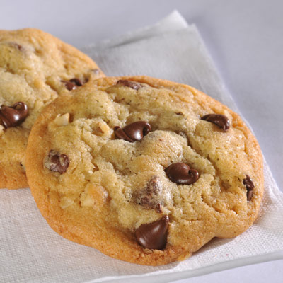

# Nestle Chocolate Chip Cookie

A chocolate chip cookie is a drop cookie that originated in the United States and features chocolate chips as its distinguishing ingredient.

The traditional recipe combines a dough composed of butter and both brown and white sugar with semi-sweet chocolate chips. Variations include recipes with other types of chocolate or additional ingredients, such as nuts or oatmeal.

## Origination

The chocolate chip cookie was accidentally developed by Ruth Graves Wakefield in 1930. She owned the Toll House Inn, in Whitman, Massachusetts, a very popular restaurant that featured home cooking in the 1930s. Her cookbook, *Toll House Tried and True Recipes*, was published in 1936 by M. Barrows; Company, New York. It included the recipe "Toll House Chocolate Crunch Cookie", which rapidly became a favorite to be baked in American homes.

## Nestle’s History of the Cookie

Wakefield is said to have been making chocolate cookies and on running out of regular baker's chocolate, substituted broken pieces of semi-sweet chocolate from Nestle thinking that they would melt and mix into the batter. They did not and the chocolate chip cookie was born. Wakefield sold the recipe to Nestle in exchange for a lifetime supply of chocolate chips. Every bag of Nestle chocolate chips sold in North America has a variation of her original recipe printed on the back.

During WWII, US soldiers from Massachusetts who were stationed overseas shared the cookies they received in care packages from back home with soldiers from other parts of the US. Soon, hundreds of soldiers were writing home asking their families to send them some Toll House cookies, and Wakefield was soon inundated with letters from around the world asking for her recipe. Thus began the nationwide craze for the chocolate chip cookie.

-   **[Original Nestle Chocolate Chip Cookie Ingredients](../../food/topics/reference-cookie-ingredients.md)**  
This famous classic American cookie is a treat no matter what the age or occasion.
-   **[Making Nestle Chocolate Chip Cookies](../../food/topics/task-making-cookies.md)**  
Follow the steps below to make the original Nestle Toll House chocolate chip cookie.

